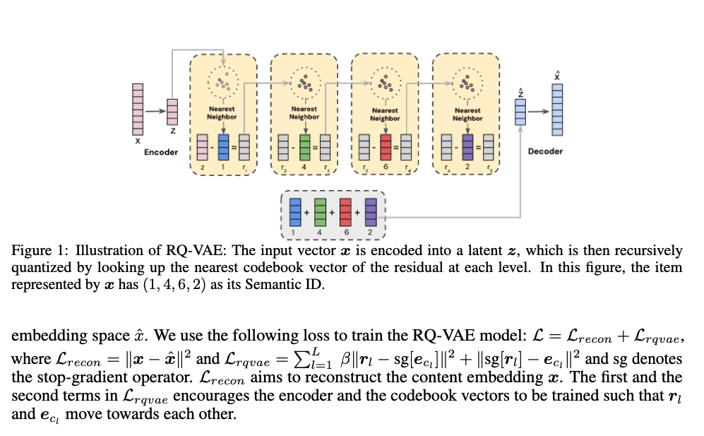

# Attempt to “Deep Research” in Hong Kong Law
## Ray Yip
Published @ June 15, 2025 at 7:39 PM HKT

Updated @ September 20, 2025 at 21:01:03 HKT 

## Introduction

I always want to automate legal research. Because (1) I always have to do it as a legal student and (2) people often ask me about their legal problems which law school simply doesn't teach.

The existing platforms available in Hong Kong either have limited search capabilities, e.g. mere keyword search, or is incredibly difficult, slow and user-hostile to navigate. From my own experience, the results returned are a list of full cases which are either mundanely relevant or unnecessarily cumbersome to digest in today’s standard.

In this article, I will outline my attempt to automate legal research, or at least, build a better alternative system than the current ones. Some of the problems I raised I do not really have a solution. I will nonetheless put them them for my future referencing purpose. 

In the era of LLM, legal research sounds like a problem [Retrieval Augmented Generation (“**RAG**“)](https://en.wikipedia.org/wiki/Retrieval-augmented_generation) can solve [This might be better solved in future with pure LLM-driven approach e.g. *Self-Retrieval:Self-Retrieval: End-to-End Information Retrieval with One Large Language Model* . But as of the date of writing, retraining the LLM whenever a case is handed down or a legislation is updated is not quite sensible in terms of costs.](sidenote).

I understand RAG in simple language as:

>> A system that automatically CTRL-C and CTRL-V something relevant to the question and pass them to LLM for answer generation.

In our context, we just need to copy the relevant legal principles from a corpus of legal rules, put them into a reasonably intelligent LLM, simple! right?

Probably not. When the pool of documents [pool of documents = Case Law + Legislations in Hong Kong. ~ 150k+ Case Law (~0.5 billion tokens) and ~300k+ legislative sections.](sidenote)  is large, deciding what is relevant becomes a hard problem.

Similarity search with vector embedding is the default position for most RAG system. But, you will note that embedding search has not yet replaced Google. 

](2025-09-20_21-12-06.png "margin google") 

Google will have for sure integrated it, but their search engine is not just built on a vector database.

There are several functional and non-functional reasons:

1.  performance issue,
2.  cost issue and
3.  that useful information retrieval is a complex field full of nuances [note the paper *On Theoretical Limitations of
Embedding-Based Retrieval*](margin).

## The Problem Statement

Any legal advice to me begins with a search problem. Given any legal related problem, the first part of the problem solving process is always finding which legal principles are relevant.

Lawyers will call this as identifying the issues. The first step is always identifying the relevant legal frameworks, before that no meaningful legal or factual issues can be laid out.

The problem is hence simple: given a legal question, return the relevant laws. 

But the question is: what is relevant?

## What is relevant?

Relevance is multi-dimensional. Assume you carry with you 40g of cocaine, wishing to sell your friend in Thailand, get caught in the HK airport and are charged with Trafficking in Dangerous Drugs (“**TDD**“). You are now worrying how long you might have to spend on jail.

A case can be relevant to your question for various reasons, and on different dimensions:

1. The age of the offender in that case is similar to you.
2. It sets out the latest sentencing guideline for TDD in cocaine.
3. It ruled on the general approach in determining sentence for TDD.
4. It sets out mitigating factors for reducing sentence generally.
5. It applied one of the mitigating factors present in your case.
6. It discussed aggravating factors for increasing sentence generally.
7. ...

Usually, a common search strategy would look something like the following:

1. Use keywords (e.g. the offence itself) to get a bunch of TDD sentence judgments.
2. Get a general idea of the sentence range by scanning through the cases.
3. Stumble across a longer case which looks like a key case of the offence.
4. Take note.
5. Scans which case resembles the client’s case at hand, based on different criteria listed above.
6. Check them out.
7. Dig out some more cases cited in cases collected so far.
8. Refine my search based on what I know so far.

“_What is relevant_” [On the other hand, how many relevant results do we need? There can be 1000 cases that are relevant to our TDD case. We might not need all of them. Which portion of them are most needed?](sidenote) cannot usually be determined with one single search. Instead, multiple search with different purposes has to be performed, in order to retrieve relevant information from the requisite different dimensions. However, this can be tedious to perform.

## Proposed System

To simulate the human search. There are five main components that I can think of:

1. A set of tools that perform different types of search
     - semantic search
     - keyword search
     - search by citation
     - ...
3. Filtering to cut down the search space
5. A simple workflow that *maps* queries from slightly different perspective and *reduces* them into a condensed summary. 

Taking references from different deep research workflows proposed by a number of interesting projects, for example:

.](2025-09-20_12-15-39.png)

](https://www.anthropic.com/_next/image?url=https%3A%2F%2Fwww-cdn.anthropic.com%2Fimages%2F4zrzovbb%2Fwebsite%2F1198befc0b33726c45692ac40f764022f4de1bf2-4584x2579.png&w=3840&q=75)

These seemingly complex agentic workflows purport to capture the multi-dimensional nature of the aforementioned *what is relevant* problem.

I am not fully convinced by the heated “LLM AI agents” paradigm nowadays. With LLM’s non-deterministic nature they usually fail at long horizon tasks. Nonetheless, a simple and short workflow, which query the database from different perspective, aggregate and summarize the results, may actually assist [Not replace.](sidenote) legal practitioners effectively.

## Eval-first

I am sold by [Eugene Yan](https://eugeneyan.com/writing/llm-patterns/#retrieval-augmented-generation-to-add-knowledge) that evaluation is important for the quality of the system.

>> Building solid evals should be the starting point for any LLM-based system or product.
>> <footer>Eugene Yan</footer>

The reason is simple. You get more informed feedback when you are nudging the system. It’s easier and more accurate to perform all sorts of testing e.g. A/B testing with a well-crafted evaluation dataset that roughly represents the input the system might encounter.

Curating high quality evaluation dataset is costly. But, ~100 data points can already provide a less subjective evaluation of the system.

One of the interesting evaluation method I came across is the [Nugget Recall](https://arxiv.org/pdf/2504.15068). In simple terms, nugget is an atomic fact that should be included in an answer. Hence, we can measure the performance by counting how many “nuggets” an answer to a query contains compared to the standard list of nuggets curated by expert that should appear in relation to a query.

In practice, I went with the Google Sheet approach outlined [here](https://x.com/skylar_b_payne/status/1958352532193091742/photo/1) as a quick start.

## Filtering

One of the limitations of vector search is that the bigger the search pool, the harder to retrieve relevant result.

The strategy we use to mitigate such limitation is simple: filtering. Based on the query or user input, the first step we should do is to narrow down the search space [Another approach could be to boost the discriminative power of the embedding model with data. Pure ml approach. Problem: need ample gpu resources and high quality dataset. We will see if we can do this later.](sidenote).

There are multiple approaches for efficient filtering that has come to my knowledge:

1. Filter by Tag
2. Semantic IDs

_Filter by Tag_ by only picking cases with tag matching the target topic, judgment type, court or offence.

But someone has to come up with the tags. Generating accurate and meaningful tag is feasible with LLM but relatively slow. Suppose it would take at least ~10s for 1 case to generate high-quality metadata. Now, 100K case means 1M seconds = 11 days, if performed consecutively! More importantly, who are going to verify and reconcile these generated tags?

[_Semantic IDs_](https://arxiv.org/abs/2306.08121) is an interesting approach explored by Google Deepmind for Youtube’s recommendation system. It is not exactly related to filtering but my intuition convinced me it seems relevant. 

A semantic ID is a compact numerical sequence representation of an item’s hierarchical information (e.g. an 8-byte sequence that captures 8 levels and 256 topics) using the trie concept . The semantic ID is learned from the dense vector embedding of an item with an architecture called the RQ-VAE to quantize the content embedding into a discrete representation.

This is useful for a stage 2 training, which uses the Semantic IDs as the inputs to train another model which learn user behaviors. An IDs based approach captured the semantic learning while addressed the problem of lack of memorization ability (i.e. to remember a particular video is revealing to certain group of users) of content-based embedding (not as unique as ID). 

The problem of Semantic IDs approach in our use case is that it is designed for item-to-item comparison; whereas what our use case needs is a query-to-item mapping. Even the semantic IDs are in place, the question of how do we map the query to the semantic IDs space remains unresolved.

However, in my opinion the trie based Semantic IDs concept is inspiring:

**pros**
- it organizes the items into hierarchical topics
- it represents the hierarchical information very compactly for each item, either the implemented discrete representation, or the conceptual equivalent of using concatenated string: `criminal_law, sexual_offence, indecent_assualt, ...`
- it supports hierarchical retrieval based on topics traversal at different level of granularity depending on the needs.

**cons**
- only one topic at each level, but items sometimes share multiple topic even within the same level.
- if implementing the unsupervised approach from the paper, takes time.
- if using self-modified approach which only captures the concept of a semantic ID, the topic allocation at each level needs a classifier.

## Conclusion

In this article, I have discussed the problem I want to solve in legal research and outlined my research and approach to the problem. Some of the features have already been implemented in [JIST](https://chat.jist.space/landing), feel free to have a try.

If you have any thoughts on some of the problems I have raised in this article, your comments or DMs are most welcomed 😃.

___

    
